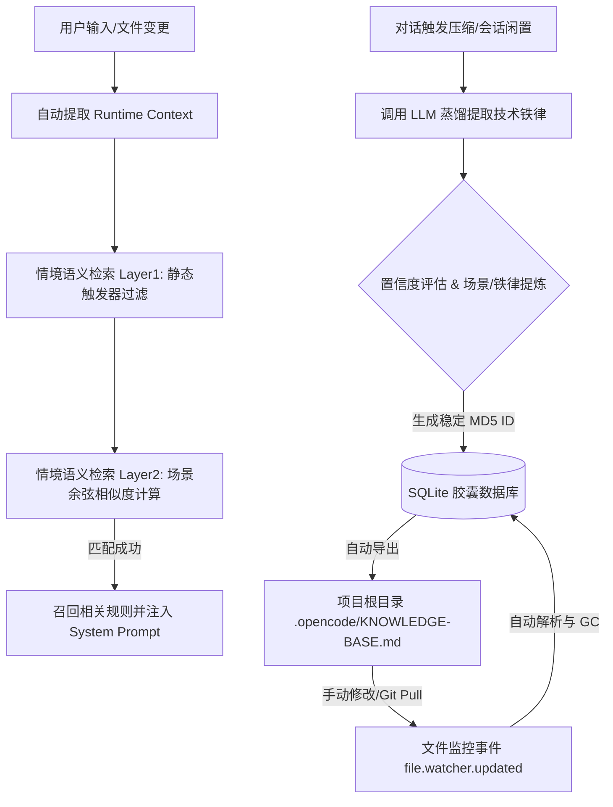

# 记忆胶囊插件 2.0 (opencode-plugin-memory-capsule)

`opencode-plugin-memory-capsule` 是为 OpenCode 设计的高性能、低消耗、面向团队协作的**场景感知记忆结晶插件**（Memory Capsule 2.0）。

它针对开发助理在面对长对话时，因上下文超出 Token 限制被系统自动截断压缩，导致核心技术共识、定制架构规范和关键决策丢失的痛点而设计。通过将对话历史（情境记忆）结晶为不可违反的规则（语义记忆），并支持双向 Git 同步，让 AI 的经验在开发团队中沉淀为长期可复用的资产。

---

## 💻 核心机制与架构

本插件基于 **情境到语义结晶（Episodic-to-Semantic Memory Crystallization）** 架构设计，采用全本地轻量级计算，不需要任何云端第三方向量数据库：



1. **场景驱动的精准向量检索（Scenario-Driven Matching）**：
   * **向量情境化**：向量数据库存储的是胶囊**适用场景（Scenario）**的 Embedding（而非直接对代码约束进行计算）。
   * **前瞻性召回**：当用户输入“*我要写一个 React 异步请求*”时，即使还没开始打字，引擎也会自动语义召回契合该场景 of React 卸载/闭包清理规则，并将其以标准格式注入 Prompt。

2. **双向 Codebase Markdown 同步（Bidirectional Git-Sync）**：
   * **Markdown 落地**：SQLite 数据库中的全部记忆自动以极佳的可读性导出到当前项目工作区的 `.opencode/KNOWLEDGE-BASE.md` 文件中。团队成员可以直接提交并推送到 Git，实现**团队共建、版本可控的 AI 记忆库**。
   * **反向注入与同步**：OpenCode 启动或文件变化时，插件会自动解析 `KNOWLEDGE-BASE.md`。如果开发者手动修改了场景、规则或者删除了某条胶囊，修改将自动同步回 SQLite 数据库，并重算向量。
   * **稳定 ID 映射**：基于标题哈希（`md5(title)`）计算出稳定 ID，保证在 Markdown 中增删改时，SQLite 的同步安全、冲突自由且具备无缝的垃圾回收（GC）能力。

3. **安全扫描保护（Security & Deep Scan Protection）**：
   * **Gitignore 智能过滤**：自动利用 `git check-ignore` 工具，在目录扫描和文件更新监听中跳过任何命中的私有依赖和临时编译文件。
   * **主目录防穿透保护**：在 Home 目录（`~`）或根目录（`/`）下调起 OpenCode 时，自动将深度递归检索（`**/`）降级为根目录下单层检索（`./`），确保不会全盘扫描用户电脑，兼顾隐私和性能。

4. **高度可观测的持久化日志**：
   * 所有胶囊结晶过程、向量计算、同步与 GC 动作均会附加 ISO 时间戳输出到本地的 `~/.config/opencode/plugins/memory-capsule/logs/plugin.log` 中。

> [!NOTE]
> **关于本地向量（Embedding）模型**：
> * 本插件采用轻量级中文向量模型 `BAAI/bge-small-zh-v1.5`，通过 `onnxruntime-web` 在本地 CPU 环境上利用 WebAssembly 线程运行，**所有检索与计算完全在本地进行，代码和隐私数据不会上传至任何第三方云端**。
> * **下载机制**：为保持包体积轻量，模型权重文件（约 90MB）在安装时不会打包下载，而是在**插件首次被 OpenCode 启动加载并执行第一笔向量化检索或胶囊合成时，自动从 Hugging Face 镜像静默下载**，并缓存在本地的 `~/.cache/huggingface/hub/` 目录下。首次运行可能会因网络下载产生几秒延迟，之后运行将完全离线且零网络消耗。

---

## ⚙️ 插件配置参数

在 OpenCode 的 `opencode.json` 的 `plugin` 选项，或插件配置面板中可调整以下行为：

| 配置项 | 类型 | 默认值 | 说明 |
| :--- | :--- | :--- | :--- |
| `matchThreshold` | `number` | `0.55` | 向量精匹配召回相似度阈值。 |
| `redundancyThreshold` | `number` | `0.88` | 胶囊去重冗余阈值。相似度高于此值的结晶会被判定为 redundant 而不予重复存入。 |
| `topK` | `number` | `5` | 单词对话中最大可匹配注入的胶囊数量。 |
| `knowledgePatterns` | `array` | `['**/KNOWLEDGE-*.md', '**/CAPSULE-*.md', '**/ARCHITECTURE.md', '**/DECISIONS.md']` | 触发知识文件构建的 Glob 模式。 |
| `useLocalEmbedding` | `boolean` | `true` | 是否优先使用本地向量模型。如果设为 `false`，则回退为 API 检索模式。 |
| `localEmbeddingModel` | `string` | `'Xenova/bge-small-zh-v1.5'` | 本地向量模型名称。支持 Hugging Face 上兼容 sentence-transformers 的 ONNX 格式模型。 |
| `useLocalDatabase` | `boolean` | `false` | 是否使用本地工作区存储 SQLite（即放在 `.opencode/capsule.db`）。默认 `false`，存储在 `~/.config/opencode` 下的集中式目录，按工作区 MD5 隔离，避免弄脏项目代码。 |
| `enableAutoDistill` | `boolean` | `false` | 会话闲置（session.idle）时是否允许在后台自动调用大模型提炼胶囊。默认关闭以防过度消耗 Token 额度。 |

---

## 🚀 安装与配置方法

由于此插件已开源托管在 GitHub 公开仓库，可以通过在 OpenCode 配置文件中直接声明来完成快捷安装（无需配置任何 GitHub SSH Key 权限）：

### 1. 全局安装配置示例

在 OpenCode 全局配置目录 `~/.config/opencode/` 下设置以下两个文件：

* **全局依赖声明 [package.json](file:///Users/gyork/.config/opencode/package.json)**：
  ```json
  {
    "dependencies": {
      "opencode-plugin-memory-capsule": "git+https://github.com/gyorkluu/opencode-plugin-memory-capsule.git"
    }
  }
  ```

* **全局启用声明 [opencode.json](file:///Users/gyork/.config/opencode/opencode.json)**：
  ```json
  {
    "$schema": "https://opencode.ai/config.json",
    "plugin": [
      "opencode-plugin-memory-capsule"
    ]
  }
  ```

* **执行安装**：
  在终端中运行以下命令，或直接重启 OpenCode 客户端：
  ```bash
  cd ~/.config/opencode && bun install
  ```

---

### 2. 项目级安装配置示例 (仅在当前工程生效)

如果你只想在特定项目工程下启用该记忆胶囊，可以在项目根目录下的 `.opencode/` 文件夹中配置：

* **项目依赖声明 `.opencode/package.json`**：
  ```json
  {
    "dependencies": {
      "opencode-plugin-memory-capsule": "git+https://github.com/gyorkluu/opencode-plugin-memory-capsule.git"
    }
  }
  ```

* **项目启用声明 `.opencode/opencode.json`**：
  ```json
  {
    "plugin": [
      "opencode-plugin-memory-capsule"
    ]
  }
  ```

* **执行安装**：
  in 项目根目录下运行命令：
  ```bash
  cd .opencode && bun install
  ```

---

## 🧪 测试与验证方法

使用内置的集成测试验证 2.0 功能：
```bash
# 运行单元测试与集成同步测试
bun test
```
测试会覆盖：
1. **情境匹配测试**：验证 Query 语义特征能够通过 `scenario` 正确匹配出 Vue Watch/Docker 容器构建等对应规则。
2. **Markdown 导出与载入**：验证 SQLite $\rightarrow$ Markdown $\rightarrow$ SQLite 擦除 $\rightarrow$ 从 Markdown 完全复原的精准逻辑。
3. **协同修改与 GC**：模拟在 Markdown 中修改版本、增加/删除规则，并验证 SQLite 中对应的胶囊被更新或正确执行垃圾回收清空。
