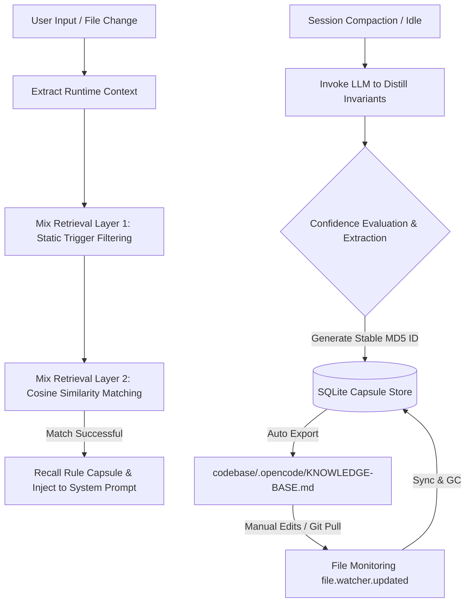

# OpenCode Memory Capsule Plugin (opencode-plugin-memory-capsule)

`opencode-plugin-memory-capsule` is a high-performance, low-overhead, team-collaborative **Scenario-Aware Memory Crystallization Plugin** (Memory Capsule 2.0) designed for OpenCode.

It targets the core developer pain point where long conversations (sessions) are automatically truncated and compressed due to context token limits, leading to the loss of technical decisions, architectural consensus, and custom code invariants. By crystallizing dialogue history (episodic memory) into permanent rule constraints (semantic memory) and supporting bidirectional Git sync, it transforms temporary chat agreements into long-term reusable codebase assets.

---

## 💻 Core Mechanisms & Architecture

The plugin runs entirely locally using lightweight computations without requiring any external cloud vector databases:



1. **Scenario-Driven Matching**:
   * **Contextual Vectorization**: Instead of vectorizing raw code constraints, the SQLite database stores the embeddings of the **`scenario` description** (e.g., *"Writing async callbacks inside React useEffect hooks"*).
   * **Proactive Recall**: When the user says *"I am creating a Vue page"*, the engine automatically recalls related Vue setup/watcher cleanup rules and injects them into the system prompt, even before you mention specific APIs or trigger a bug.

2. **Bidirectional Codebase Markdown Syncing**:
   * **Git-Trackable Knowledge**: SQLite rules are automatically serialized and exported into a human-readable, git-trackable Markdown file at `.opencode/KNOWLEDGE-BASE.md` inside your codebase. The entire development team can commit and push it to share knowledge.
   * **Import & Synchronization**: On start, the plugin parses `KNOWLEDGE-BASE.md`. Any manual additions, edits, or deletions made by developers are synced back into SQLite, and embeddings are recomputed.
   * **Stable ID Mapping**: Generates a stable, title-derived MD5 hash (`md5(title)`) as the database primary key. This prevents primary key conflicts during synchronization and enables clean garbage collection (deleting capsules in SQLite that are no longer present in the Markdown file).

3. **Workspace Protection & Security**:
   * **Gitignore Compliance**: Automatically runs `git check-ignore` to skip scanning or indexing ignored files, dependencies, and build outputs.
   * **Home Directory Scan Protection**: Restricts recursive glob scans (`**/`) to root level (`./`) when the workspace matches the user's home directory (`~`) or root (`/`) to prevent computer-wide files indexing.

4. **Persistent Local Logging**:
   * Appends ISO-timestamped run logs under `~/.config/opencode/plugins/memory-capsule/logs/plugin.log` for debugging and performance auditing.

> [!NOTE]
> **About the Local Embedding Model**:
> * This plugin uses the lightweight `BAAI/bge-small-zh-v1.5` sentence-transformer model via `onnxruntime-web` to perform vector encoding entirely locally on the CPU using WebAssembly threads. **Your code and private data will never be sent to any third-party cloud embedding service.**
> * **Download & Cache**: To keep the package lightweight, the model files (approx. 90MB) are not bundled in the package. Instead, **they are automatically downloaded from Hugging Face on the first plugin run** (when executing the first query or distillation) and cached in `~/.cache/huggingface/hub/`. Subsequent runs are fully offline.

---

## ⚙️ Configuration Parameters

Configure these parameters in `opencode.json` or through the OpenCode settings interface:

| Option | Type | Default | Description |
| :--- | :--- | :--- | :--- |
| `matchThreshold` | `number` | `0.55` | Cosine similarity threshold for recalling capsules. |
| `redundancyThreshold` | `number` | `0.88` | Similarity threshold for preventing redundant capsules from being saved. |
| `topK` | `number` | `5` | Maximum number of capsules to retrieve and inject per query. |
| `knowledgePatterns` | `array` | `['**/KNOWLEDGE-*.md', '**/CAPSULE-*.md', '**/ARCHITECTURE.md', '**/DECISIONS.md']` | Glob patterns to search for workspace files to chunk and index. |
| `useLocalEmbedding` | `boolean` | `true` | When `true`, prioritizes local WASM embeddings. Set to `false` to disable local model execution and fall back to API. |
| `localEmbeddingModel` | `string` | `'Xenova/bge-small-zh-v1.5'` | The Hugging Face repository name of the local ONNX embedding model. Supports any compatible sentence-transformers model. |
| `useLocalDatabase` | `boolean` | `false` | When `false`, stores SQLite DB files in `~/.config/opencode/` grouped by project MD5 hash. Set to `true` to force saving under `.opencode/capsule.db`. |
| `enableAutoDistill` | `boolean` | `false` | When `true`, allows the plugin to automatically distill capsules during session idle periods. |

---

## 🚀 Installation & Configuration

Since this plugin is hosted in a public GitHub repository, anyone can load it directly by declaring it in the OpenCode configuration files without requiring SSH key setup.

### 1. Global Installation (Applies to all workspaces)

In your global configuration directory `~/.config/opencode/`, configure the following files:

* **Global dependencies declaration: [package.json](file:///Users/gyork/.config/opencode/package.json)**
  ```json
  {
    "dependencies": {
      "opencode-plugin-memory-capsule": "git+https://github.com/gyorkluu/opencode-plugin-memory-capsule.git"
    }
  }
  ```

* **Global plugin activation: [opencode.json](file:///Users/gyork/.config/opencode/opencode.json)**
  ```json
  {
    "$schema": "https://opencode.ai/config.json",
    "plugin": [
      "opencode-plugin-memory-capsule"
    ]
  }
  ```

* **Execute installation**:
  Run this command in your terminal, or simply restart your OpenCode client:
  ```bash
  cd ~/.config/opencode && bun install
  ```

---

### 2. Project-level Installation (Applies only to current workspace)

To enable the memory capsule plugin only for a specific project, place these configurations under the `.opencode/` folder in your project root:

* **Project dependencies declaration: `.opencode/package.json`**
  ```json
  {
    "dependencies": {
      "opencode-plugin-memory-capsule": "git+https://github.com/gyorkluu/opencode-plugin-memory-capsule.git"
    }
  }
  ```

* **Project plugin activation: `.opencode/opencode.json`**
  ```json
  {
    "plugin": [
      "opencode-plugin-memory-capsule"
    ]
  }
  ```

* **Execute installation**:
  Run this command from your project root:
  ```bash
  cd .opencode && bun install
  ```

---

## 🧪 Testing

The codebase includes an integration test suite validating scenario matching, Markdown serialization, and bidirectional synchronization:

```bash
bun test
```
The test suite covers:
1. **Scenario Matching**: Verifies query inputs route accurately to corresponding capsule scenarios (e.g. matching Vue watcher cleanup rules).
2. **Markdown Sync & Restore**: Verifies SQLite DB serialization to `.opencode/KNOWLEDGE-BASE.md` and complete database restoration upon database deletion.
3. **Collaborative GC & Sync**: Simulates user edits, additions, and deletions in Markdown, confirming that SQLite records match the Markdown file.
