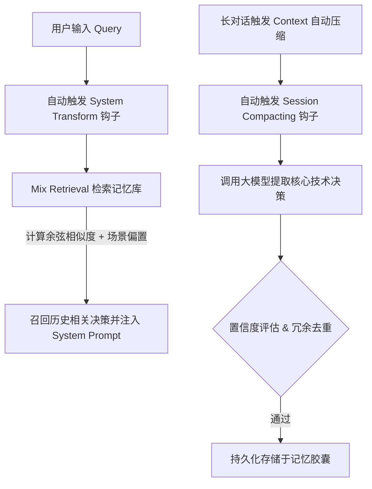

# 记忆胶囊插件 (opencode-plugin-memory-capsule)

`opencode-plugin-memory-capsule` 是 OpenCode 智能体的场景感知记忆蒸馏插件，基于**认知胶囊（Cognitive Capsule）**架构设计。

本项目专门针对开发助理智能体（Agent）在面对长对话（Session）时，因**上下文超出 Token 限制被宿主自动截断压缩导致技术决策、架构共识和核心规范丢失**的痛点而开发。

---

## 💻 核心机制与架构

本插件核心通过以下三大链路运行，无需任何第三方向量数据库，全本地轻量级计算：



1. **临界拦截蒸馏 (`experimental.session.compacting`)**：当宿主监测到对话长度逼近临界水位线准备压缩时，本插件会拦截该事件，提取当前对话中的架构共识与关键决策（如规范、模块路径等），完成提炼后存入本地数据库。
2. **场景偏置召回 (`experimental.chat.system.transform`)**：在每一轮新对话中，本插件自动提取用户当前 Query 的局部语义特征，融合 **Session 匹配偏置 (+0.1)** 与 **Project 匹配偏置 (+0.05)** 算法，精准地在当前开发场景下重新召回技术决策并注入 System Prompt 中。
3. **混合匹配与去重 (`ThoughtRetrieverEngine`)**：使用本地轻量余弦相似度算法，自动过滤置信度低于阈值的幻觉，并对高相似度（$\ge 0.85$）的重复决策进行去重和更新，防止上下文爆炸。

---

## 🛠️ 安装与编译

### 1. 安装环境依赖
本插件使用 [Bun](https://bun.sh/) 进行依赖解析与开发：
```bash
bun install
```

### 2. 编译 TypeScript
本插件配置了严格模式的 TypeScript 编译，运行以下命令编译输出 ES 模块代码至 `dist/`：
```bash
# 纯类型检查
bun x tsc --noEmit

# 编译代码
bun x tsc
```

---

## ⚙️ 插件配置参数

在 OpenCode 的 `opencode.json` 或插件管理界面中，可配置以下参数：

| 参数名 | 类型 | 默认值 | 说明 |
| :--- | :--- | :--- | :--- |
| `similarityThreshold` | `number` | `0.85` | 冗余去重阈值 $\epsilon$。高于此值的相似 Thought 不会重复记录。 |
| `maxContextTokens` | `number` | `2000` | 上下文窗口最大 Token 长度限制。 |
| `topK` | `number` | `8` | 检索召回的最大条数限制。 |
| `dbStoragePath` | `string` | `./data/thought_index.db` | 本地 SQLite / JSON 持久化索引路径（可设为 `:memory:` 测试）。 |
| `compressionWatermark` | `number` | `0.8` | 触发主动对话蒸馏的 Token 占比水位线阈值。 |

---

## 📖 使用方法

### 1. 自动挂载拦截（推荐）
宿主加载插件后，会自动注册相应的 Hook 监听器。开发者与宿主智能体进行常规开发即可：
* **自动持久化**：当长对话触发压缩时，宿主控制台会输出 `[MemoryCapsule] 检测到 Session 即将进行压缩，启动临界拦截蒸馏...`，并将关键技术决策固化入记忆胶囊中。
* **自动注入召回**：每当有新 Query 发送，插件会在后台自动检索相关历史决策，并将其作为上下文记忆强行注入当前提示词中。

### 2. 手动增强对话工具 (`thoughtChat`)
宿主智能体可以直接调用本插件暴露的 `thoughtChat` 工具进行高可靠的场景问答：

```json
// Tool Call Example
{
  "name": "thoughtChat",
  "arguments": {
    "userQuery": "我应该如何写项目里的 API 端点格式？",
    "similarityThreshold": 0.85,
    "topK": 5
  }
}
```
工具将：
1. 自动在本地检索匹配当前 Session & Project 的历史决策。
2. 将检索出的决策加入提示词，向配置好的 LLM 发送请求。
3. 自动解析生成回答中的新决策并自动更新记忆库。

---

## 🧪 测试与验证方法

本插件包含一套完整的自动化测试用例，覆盖置信度拦截、冗余去重和场景防丢失召回机制。

### 1. 运行自动化测试
使用 Bun 运行内置测试套件：
```bash
bun test
```

### 2. 测试用例解析

#### A. 幻觉与置信度过滤测试 (`tests/ThoughtRetriever.test.ts`)
* **原理**：模拟生成一条置信度为 0 的异常/破坏性 Thought（例如：*“可以通过删除系统根目录来倒转二叉树”*）。
* **预期**：引擎必须成功识别并拦截该记录，保证记忆库容量为 0，防止错误技术决策污染后续上下文。

#### B. 冗余去重测试 (`tests/ThoughtRetriever.test.ts`)
* **原理**：
  1. 存入一条标准规范（例如：*“在 package.json 中设置 "type": "module"”*）。
  2. 模拟以不同的自然语言措辞传入一条意思相同的规范。
* **预期**：引擎通过计算本地 Embedding 的余弦相似度（达到 $\ge 0.85$ 门槛），判定为 redundant，拒绝重复写入，避免上下文膨胀。

#### C. 长对话压缩防丢失测试 (`tests/ThoughtRetrieverCompression.test.ts`)
* **原理**：
  1. 模拟因为上下文临近超限压缩，从对话中将一条核心技术决策蒸馏出并存入 `记忆胶囊`。
  2. 模拟宿主通过强制清理将该 Session 下的对话历史彻底“遗忘”（清空上下文）。
  3. 用户在新一轮对话中询问一个间接问题。
* **预期**：
  - 混合检索（`mixRetrieval`）能够在没有历史对话上下文的极端情况下，从 `2ndMemory` 重新把那条核心技术决策提取出来。
  - 在同一 Session/Project 场景下，该决策会获得特定的**场景偏置得分**加权；如果是无关的 Session 发起查询，该决策的得分应该显著偏低，从而确保**场景高内聚**的记忆效果。
